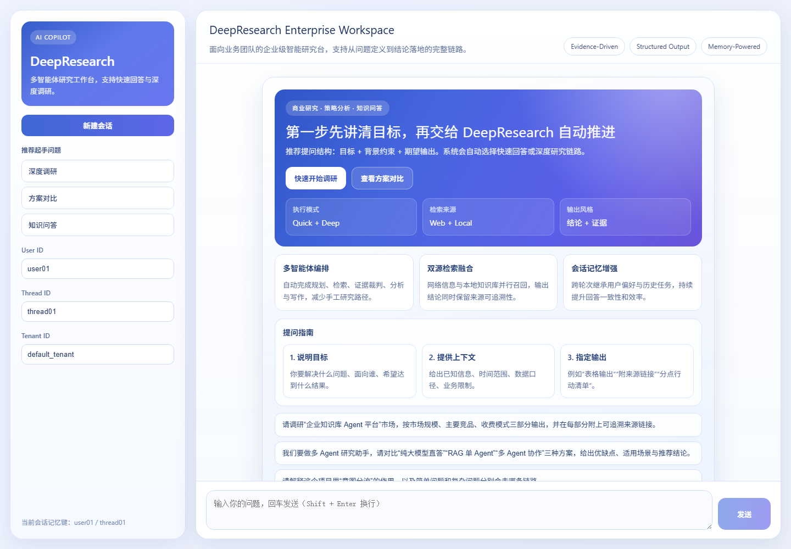
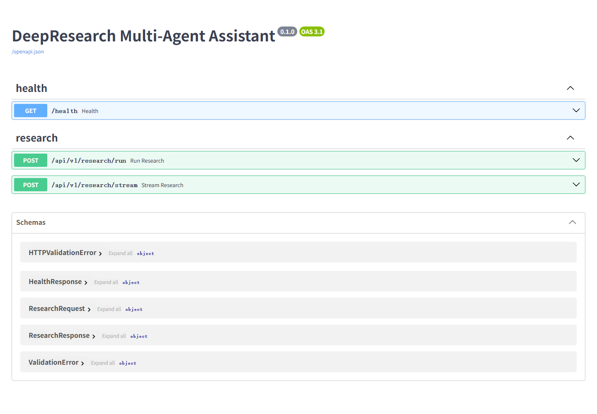

# DeepResearch 多 Agent 深度研究助手

一个基于 LangGraph 的多 Agent 深度研究系统：自动完成意图分流、研究规划、网络/本地双源检索、证据裁判、分析与报告写作，并提供 FastAPI 后端与 Vue 3 前端展示执行过程。

## 项目截图

### 前端界面



### 后端 API 文档（Swagger UI）



## 快速开始

```powershell
cd deep_research
Copy-Item .env.docker.example .env.docker
# 编辑 .env.docker，填入 DASHSCOPE_API_KEY（必填）和 BOCHA_API_KEY（选填）
docker compose --env-file .env.docker up -d --build
```

启动后：

- 前端：http://localhost:8080
- 后端 API：http://localhost:8000
- 健康检查：http://localhost:8000/health
- API 文档：http://localhost:8000/docs

更详细的部署说明见 [deep_research/README-部署说明.md](deep_research/README-部署说明.md) 和 [使用说明.md](使用说明.md)。

## 目录结构

```text
deep_research/
├── app/
│   ├── mult_agents/       # LangGraph 多 Agent 核心编排
│   ├── backend/           # FastAPI 接口层
│   ├── eval/              # 评估脚本与样例
│   └── test/              # 接口测试脚本
├── front/agent_front/     # Vue 3 前端
├── docker-compose.yml     # 应用 + 基础设施编排
├── config.json            # 本地运行配置（api_key 留空时读环境变量）
├── requirements.txt
└── pyproject.toml
```

## 隐私提示

- 真实密钥只保存在本机 `deep_research/.env.docker`，该文件已在 `.gitignore` 中排除，不会被提交。
- 仓库内只保留 `.env.example` / `.env.docker.example` 模板。
- 请勿将 API Key 写入源码、文档或提交到仓库。
